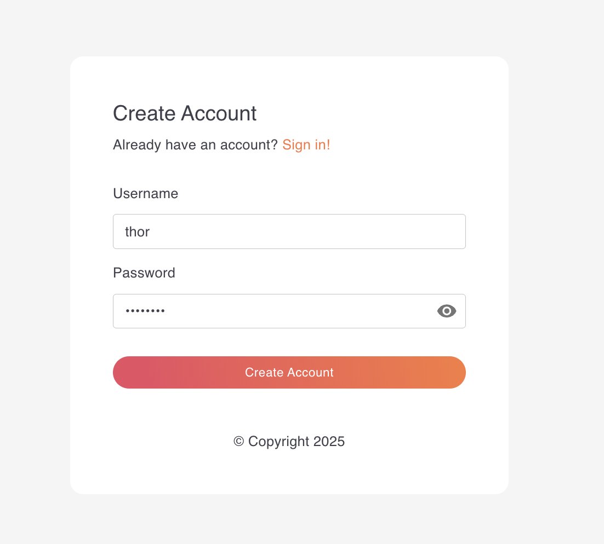
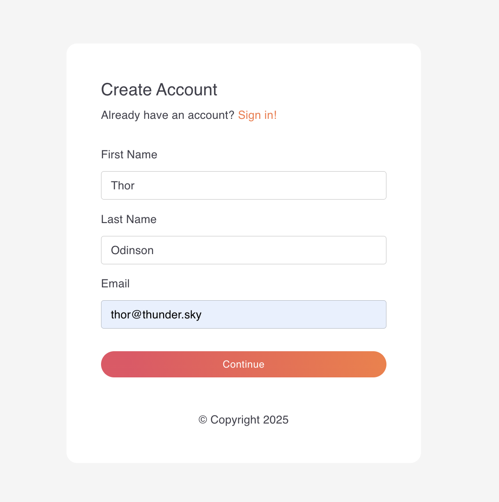
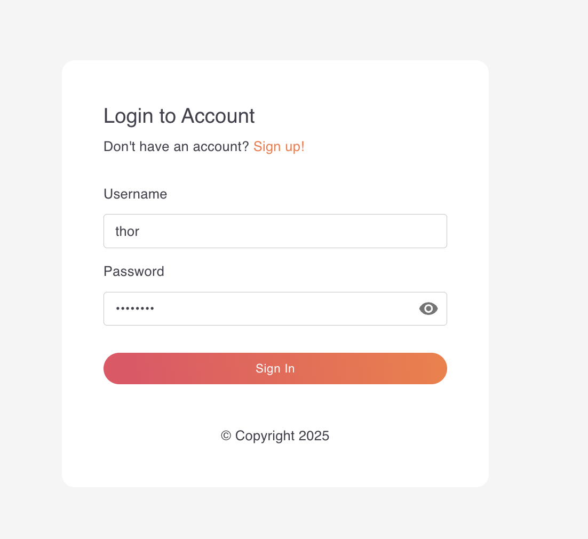

# WSO2 Thunder ⚡
### Identity Management Suite

[](https://opensource.org/licenses/Apache-2.0)
[](https://github.com/asgardeo/thunder/commits/main)
[](https://github.com/asgardeo/thunder/issues)

Thunder is a modern, open-source identity management service designed for teams building secure, customizable authentication experiences across applications, services, and AI agents. It enables developers to design and orchestrate login, registration, and recovery flows using a flexible identity flow designer.

Designed for extensibility, scalability, and seamless containerized deployment, Thunder integrates naturally with microservices and DevOps environments—serving as the core identity layer for your cloud platform.

---

## 🚀 Features

- **Standards-Based**
  - OAuth 2/ OpenID Connect (OIDC): Client Credentials, Authorization Code, Refresh Token
- **Login Options:**
  - Basic Authentication (Username/Password)
  - Social Logins: Google, Github
  - SMS OTP
- **Registration Options:**
  - Username/Password
  - Social Registration: Google, Github
  - SMS OTP
- **RESTful APIs:**
  - App Native Login/Registration
  - User Management
  - Application Management
  - Identity Provider Management
  - Message Notification Sender Management

---

## ⚡ Quickstart

This Quickstart guide will help you get started with WSO2 Thunder quickly. It walks you through downloading and running the product, trying out the sample app, and exploring registering a user, logging in, and using the Client Credentials flow.

### Download and Run WSO2 Thunder

You can run WSO2 Thunder either by downloading the release artifact or using the official Docker image.

#### Option 1: Run from Release Artifact

Follow these steps to download the latest release of WSO2 Thunder and run it locally.

1. **Download the distribution from the latest release**

    Download `thunder-<version>-<os>-<arch>.zip` from the [latest release](https://github.com/asgardeo/thunder/releases/latest) for your operating system and architecture.

    For example, if you are using a MacOS machine with a Apple Silicon (ARM64) processor, you would download `thunder-<version>-macos-arm64.zip`.

2. **Unzip the product**

    Unzip the downloaded file using the following command:

    ```bash
    unzip thunder-<version>-<os>-<arch>.zip
    ```

    Navigate to the unzipped directory:

    ```bash
    cd thunder-<version>-<os>-<arch>/
    ```

3. **Seed the database with initial data**

    Thunder uses an embedded sqlite database by default. To seed the database with initial data, run the following command:

    ```bash
    ./scripts/seed_data.sh -type sqlite -seed dbscripts/thunderdb/seed_data_sqlite.sql -path repository/database/thunderdb.db
    ```

    This will insert the initial data into the database, including the default user, application, and identity provider configurations.

4. **Start the product**

    Start the product using the following command:

    If you are using a Linux or macOS machine:

    ```bash
    bash start.sh
    ```

    If you are using a Windows machine:

    ```bash
    start.bat
    ```

#### Option 2: Run with Docker

Follow these steps to run WSO2 Thunder using Docker.

1. **Pull the Docker image**

    ```bash
    docker pull ghcr.io/asgardeo/thunder:latest
    ```

2. **Run the container**

    ```bash
    docker run --rm \
      -p 8090:8090 \
      ghcr.io/asgardeo/thunder:latest
    ```

    Optionally if you want to modify the server configurations, you can mount a custom `deployment.yaml` file. Create a `deployment.yaml` file in your working directory similar to the [deployment.yaml](https://github.com/asgardeo/thunder/blob/main/backend/cmd/server/repository/conf/deployment.yaml), and mount it as below:

    ```bash
    docker run --rm \
      -p 8090:8090 \
      -v $(pwd)/deployment.yaml:/opt/thunder/repository/conf/deployment.yaml \
      ghcr.io/asgardeo/thunder:latest
    ```

    Optionally if you want to use custom configurations or certificates, you can mount them as follows:

    ```bash
    docker run --rm \
      -p 8090:8090 \
      -v $(pwd)/deployment.yaml:/opt/thunder/repository/conf/deployment.yaml \
      -v $(pwd)/certs/server.cert:/opt/thunder/repository/resources/security/server.cert \
      -v $(pwd)/certs/server.key:/opt/thunder/repository/resources/security/server.key \
      ghcr.io/asgardeo/thunder:latest
    ```

### Try Out the Product

#### Try Out with the Sample App

To quickly get started with Thunder, you can use the sample app provided with the product. This guide demonstrates how to download and run the sample app, self register a user and try out login to the sample app.

##### Download and Run the Sample App

1. Download the sample app from the latest release

    Download `thunder-sample-app-<version>-<os>-<arch>.zip` from the [latest release](https://github.com/asgardeo/thunder/releases/latest) for your operating system and architecture.

2. Unzip and navigate to the sample app directory

    ```bash
    unzip thunder-sample-app-<version>-<os>-<arch>.zip
    cd thunder-sample-app-<version>-<os>-<arch>/
    ```

3. Configure the sample app

    Open the `runtime.json` file in the thunder-sample-app-<version>-<os>-<arch>/app directory and update the configurations as per your setup. The default configurations should work for most cases, but you can customize the following properties:

    - `applicationID`: The ID of the application you want to use for authentication. By default, it is set to `550e8400-e29b-41d4-a716-446655440000`.
    - `flowEndpoint`: The root endpoint for the flow execution API. By default, it is set to `https://localhost:8090/flow`.

4. Start the sample app

    ```bash
    sh start.sh
    ```

Open your browser and navigate to [https://localhost:3000](https://localhost:3000) to see the sample app in action.

##### Self Register a User

To self register a user in the sample app, follow these steps:

1. Open the sample app in your browser at [https://localhost:3000](https://localhost:3000) and click on the "Sign up" button.

2. Provide a username and password for the new user and click on the "Create Account" button.

    

3. Fill in the additional user attributes such as first name, last name and email address. Click "Continue" to complete the registration.

    

4. After successful registration, you will be automatically logged in to the sample application.

##### Login to the Sample App

To log in to the sample app, follow these steps:

1. Open the sample app in your browser at [https://localhost:3000](https://localhost:3000).

2. Enter username and password you used during the self registration process and click on the "Sign In" button.

    

3. If the login is successful, you will be redirected to the home page of the sample app with the access token.

#### Try Out Client Credentials Flow

The Client Credentials flow is used to obtain an access token for machine-to-machine communication. This flow does not require user interaction and is typically used for server-to-server communication.

To try out the Client Credentials flow, follow these steps:

1. Create a Client Application

   Create a client application in the system to use for the Client Credentials flow. You can use the following cURL command to create a new application. Alternatively, you can use the initial application created with the data seeding script.

    ```bash
    curl -kL -X POST -H 'Content-Type: application/json' -H 'Accept: application/json' https://localhost:8090/applications \
    -d '{
        "name": "Test Sample App",
        "description": "Initial testing App",
        "auth_flow_graph_id": "auth_flow_config_basic",
        "inbound_auth_config": [
            {
                "type": "oauth2",
                "config": {
                    "client_id": "<client_id>",
                    "client_secret": "<client_secret>",
                    "redirect_uris": [
                        "https://localhost:3000"
                    ],
                    "grant_types": [
                        "client_credentials"
                    ],
                    "token_endpoint_auth_methods": [
                        "client_secret_basic",
                        "client_secret_post"
                    ]
                }
            }
        ]
    }'
    ```

2. Obtain an Access Token

   Use the following cURL command to obtain an access token using the Client Credentials flow. Make sure to replace the `<client_id>` and `<client_secret>` with the values you used when creating the client application.

    ```bash
    curl -k -X POST https://localhost:8090/oauth2/token \
      -d 'grant_type=client_credentials' \
      -u '<client_id>:<client_secret>'
    ```

---

<details>
<summary><h2>🔍 Feature Walkthrough</h2></summary>

</br><p>This section provides a detailed walkthrough of the features supported by Thunder. You can try out these flows using the sample app provided with the product or by using the provided curl commands depending on the use case.</p>

<details>
<summary><h3>Standards-Based Flows</h3></summary>

<p>Thunder supports OAuth 2.0 and OpenID Connect (OIDC) standards for authentication and authorization. The following flows are supported:</p>

<details>
<summary><h4>Client Credentials Flow</h4></summary>

<p>The Client Credentials flow is used to obtain an access token for machine-to-machine communication. This flow does not require user interaction and is typically used for server-to-server communication.</p>

<p>To try out the Client Credentials flow, follow these steps:</p>

1. **Create a Client Application**

    Create a client application in the system to use for the Client Credentials flow. You can use the following cURL command to create a new application. Alternatively, you can use the initial application created with the data seeding script.

    ```bash
    curl -kL -X POST -H 'Content-Type: application/json' -H 'Accept: application/json' https://localhost:8090/applications \
    -d '{
        "name": "Test Sample App",
        "description": "Initial testing App",
        "auth_flow_graph_id": "auth_flow_config_basic",
        "inbound_auth_config": [
            {
                "type": "oauth2",
                "config": {
                    "client_id": "<client_id>",
                    "client_secret": "<client_secret>",
                    "redirect_uris": [
                        "https://localhost:3000"
                    ],
                    "grant_types": [
                        "client_credentials"
                    ],
                    "token_endpoint_auth_methods": [
                        "client_secret_basic",
                        "client_secret_post"
                    ]
                }
            }
        ]
    }'
    ```

2. **Obtain an Access Token**

    Use the following cURL command to obtain an access token using the Client Credentials flow. Make sure to replace the `<client_id>` and `<client_secret>` with the values you used when creating the client application.

    ```bash
    curl -k -X POST https://localhost:8090/oauth2/token \
      -d 'grant_type=client_credentials' \
      -u '<client_id>:<client_secret>'
    ```

    If the request is successful, you will receive a response containing the access token:

    ```json
    {
      "access_token": "<access_token>",
      "token_type": "Bearer",
      "expires_in": 3600
    }
    ```

</details>
<details>
<summary><h4>Authorization Code Flow</h4></summary>

<p>The Authorization Code flow is used to obtain an access token after the user authenticates. This flow is typically used for web applications where a user redirection is required to complete the authentication process.</p>

1. **Configure a Gate Client**

    Authorization code flow requires you to setup a gate client to handle the login and error redirection. Add the following configurations to the `deployment.yaml` file to configure your own gate client.

    ```yaml
    gate_client:
      hostname: "localhost"
      port: 9090
      scheme: "https"
      login_path: "/login"
      error_path: "/error"
    ```

    Make sure to restart the server after making this change.

2. **Create a Client Application**

    Create a client application in the system to use for the Authorization Code flow. You can use the following cURL command to create a new application. Alternatively, you can use the initial application created with the data seeding script.

    ```bash
    curl -kL -X POST -H 'Content-Type: application/json' -H 'Accept: application/json' https://localhost:8090/applications \
    -d '{
        "name": "Test Sample App",
        "description": "Initial testing App",
        "auth_flow_graph_id": "auth_flow_config_basic",
        "inbound_auth_config": [
            {
                "type": "oauth2",
                "config": {
                    "client_id": "<client_id>",
                    "client_secret": "<client_secret>",
                    "redirect_uris": [
                        "https://localhost:3000"
                    ],
                    "grant_types": [
                        "client_credentials"
                    ],
                    "token_endpoint_auth_methods": [
                        "client_secret_basic",
                        "client_secret_post"
                    ]
                }
            }
        ]
    }'
    ```

3. **Create a User**

    Create a user in the system if you haven't already. You can use the following cURL command to create a user with the required attributes.

    ```bash
    curl -kL -H 'Content-Type: application/json' https://localhost:8090/users \
    -d '{
        "organizationUnit": "456e8400-e29b-41d4-a716-446655440001",
        "type": "superhuman",
        "attributes": {
            "username": "thor",
            "password": "<password>",
            "email": "thor@thunder.sky",
            "firstName": "Thor",
            "lastName": "Odinson",
            "age": 1534,
            "abilities": [
                "strength",
                "speed",
                "healing"
            ],
            "address": {
                "city": "Asgard",
                "zip": "00100"
            }
        }
    }'
    ```

4. **Start the Authorization Code Flow**

    - Open the following URL in your browser to start the authorization code flow. Make sure to replace `<client_id>` with the client ID of the application you created in the previous step.

        ```bash
        https://localhost:8090/oauth2/authorize?response_type=code&client_id=<client_id>&redirect_uri=https://localhost:3000&scope=openid&state=state_1
        ```

    - You will be redirected to the login page of the gate client. If you have configured a custom gate client, you will see the login page of that client.

    - Enter the credentials of the user you created in the first step.

    - After successful authentication, you will be redirected to the redirect URI with the authorization code and state.

        ```bash
        https://localhost:3000/?code=<code>&state=state_1
        ```

    - Copy the authorization code and exchange it for an access token using the following cURL command:

        ```bash
        curl -k -X POST 'https://localhost:8090/oauth2/token' \
        -u '<client_id>:<client_secret>' \
        -d 'grant_type=authorization_code' \
        -d 'redirect_uri=https://localhost:3000' \
        -d 'code=<code>'
        ```

    - If the request is successful, you will receive a response containing the access token:

        ```json
        {
          "access_token": "<access_token>",
          "token_type": "Bearer",
          "expires_in": 3600,
        }
        ```

</details>

<details>
<summary><h4>Refresh Token Flow</h4></summary>

<p>The Refresh Token flow is used to obtain a new access token using a refresh token. This flow is typically used when the access token has expired and the user does not need to re-authenticate.</p>

<p>Refresh token flow can only be try out with the Authorization Code flow. To try out the Refresh Token flow, follow these steps:</p>

1. **Create a Client Application**

    Create a client application in the system to use for the Refresh Token flow. You can use the following cURL command to create a new application. Alternatively, you can use the initial application created with the data seeding script.

    ```bash
    curl -kL -X POST -H 'Content-Type: application/json' -H 'Accept: application/json' https://localhost:8090/applications \
    -d '{
        "name": "Test Sample App",
        "description": "Initial testing App",
        "auth_flow_graph_id": "auth_flow_config_basic",
        "inbound_auth_config": [
            {
                "type": "oauth2",
                "config": {
                    "client_id": "<client_id>",
                    "client_secret": "<client_secret>",
                    "redirect_uris": [
                        "https://localhost:3000"
                    ],
                    "grant_types": [
                        "client_credentials"
                    ],
                    "token_endpoint_auth_methods": [
                        "client_secret_basic",
                        "client_secret_post"
                    ]
                }
            }
        ]
    }'
    ```

2. **Start the Authorization Code Flow**

    Follow the steps in the [Authorization Code Flow](#authorization-code-flow) section to obtain an access token and a refresh token.

    After successful authentication, you will receive a response containing the access token and the refresh token:

    ```json
    {
      "access_token": "<access_token>",
      "token_type": "Bearer",
      "expires_in": 3600,
      "refresh_token": "<refresh_token>"
    }
    ```

3. **Obtain a New Access Token Using the Refresh Token**

    Use the following cURL command to obtain a new access token using the refresh token. Make sure to replace `<client_id>`, `<client_secret>`, and `<refresh_token>` with the values you used when creating the client application and the refresh token you received in the previous step.

    ```bash
    curl -k -X POST 'https://localhost:8090/oauth2/token' \
    -u '<client_id>:<client_secret>' \
    -d 'grant_type=refresh_token' \
    -d 'refresh_token=<refresh_token>'
    ```

    If the request is successful, you will receive a response containing the new access token:

    ```json
    {
      "access_token": "<new_access_token>",
      "token_type": "Bearer",
      "expires_in": 3600,
      "refresh_token": "<new_refresh_token>"
    }
    ```

</details>
<details>
<summary><h4>JWKS Endpoint</h4></summary>

<p>Thunder provides a JWKS (JSON Web Key Set) endpoint to retrieve the public keys used to verify the signatures of JWTs (JSON Web Tokens) issued by the server. This is useful for clients that need to validate the tokens.</p>

<p>To retrieve the JWKS, you can use the following cURL command:</p>

```bash
curl -kL https://localhost:8090/oauth2/jwks
```

</details>
</details>

<details>
<summary><h3>App Native Authentication</h3></summary>

</br><p>Thunder supports app native authentication flows, allowing users to execute login flows via REST APIs. This is particularly useful for mobile and desktop applications that require a native login experience.</p>

  > Note: Refer [Authentication Flow Customization Guide](/docs/content/customize-auth-flow.md) for more details on customizing authentication flows.

<details>
<summary><h4>Login with Username and Password</h4></summary>

1. **Create a User**

    Create a user in the system if you haven't already. You can use the following cURL command to create a user with the required attributes.

    ```bash
    curl -kL -H 'Content-Type: application/json' https://localhost:8090/users \
    -d '{
        "organizationUnit": "456e8400-e29b-41d4-a716-446655440001",
        "type": "superhuman",
        "attributes": {
            "username": "thor",
            "password": "<password>",
            "email": "thor@thunder.sky",
            "firstName": "Thor",
            "lastName": "Odinson",
            "age": 1534,
            "abilities": [
                "strength",
                "speed",
                "healing"
            ],
            "address": {
                "city": "Asgard",
                "zip": "00100"
            }
        }
    }'
    ```

2. **Configure an Application with Username/Password Login**

    Create an application or update the initial application created with the data seeding script to use the username/password login template. You can use the following cURL command to create a new application.

    ```bash
    curl -kL -X POST -H 'Content-Type: application/json' -H 'Accept: application/json' https://localhost:8090/applications \
    -d '{
        "name": "App Native Login 1",
        "description": "Sample application for App native login",
        "auth_flow_graph_id": "auth_flow_config_basic"
    }'
    ```

    Alternatively, you can update the initial application created with the data seeding script with the following cURL command:

    ```bash
    curl -kL -X PUT -H 'Content-Type: application/json' -H 'Accept: application/json' https://localhost:8090/applications/550e8400-e29b-41d4-a716-446655440000 \
    -d '{
        "name": "Test SPA",
        "description": "Initial testing App",
        "auth_flow_graph_id": "auth_flow_config_basic",
        "inbound_auth_config": [
            {
                "type": "oauth2",
                "config": {
                    "client_id": "<client_id>",
                    "client_secret": "<client_secret>",
                    "redirect_uris": [
                        "https://localhost:3000"
                    ],
                    "grant_types": [
                        "client_credentials",
                        "authorization_code",
                        "refresh_token"
                    ],
                    "response_types": [
                        "code"
                    ],
                    "token_endpoint_auth_methods": [
                        "client_secret_basic",
                        "client_secret_post"
                    ]
                }
            }
        ]
    }'
    ```

3. **Start the Login Flow**

    Start login flow for the application with the following cURL command:

    ```bash
    curl -kL -H 'Accept: application/json' -H 'Content-Type: application/json' https://localhost:8090/flow/execute \
    -d '{
        "applicationId": "<application_id>",
        "flowType": "AUTHENTICATION"
    }'
    ```

    You'll receive a response similar to the following:

    ```json
    {
        "flowId": "db93a19e-c23f-4cfc-a45f-0e0bc157f6d5",
        "flowStatus": "PROMPT_ONLY",
        "type": "VIEW",
        "data": {
          "inputs": [
            {
                "name": "username",
                "type": "string",
                "required": true
            },
            {
                "name": "password",
                "type": "string",
                "required": true
            }
          ]
        }
    }
    ```

4. **Complete the Login Flow**

    Make the second cURL request to complete the login flow. Make sure to replace `<flow_id>` with the `flowId` received in the previous response. Also, replace the `username` and `password` with the credentials of the user you created in the first step.

    ```bash
    curl -kL -H 'Content-Type: application/json' https://localhost:8090/flow/execute \
    -d '{
        "flowId": "<flow_id>",
        "inputs": {
            "username": "thor",
            "password": "<password>"
        }
    }'
    ```

    If the login is successful, you will receive a response with the auth assertion.

</details>
<details>
<summary><h4>Login with Google</h4></summary>

1. **Create a Google OAuth Application**

    Create an OAuth application in your Google account following the instructions given in the [Google documentation](https://developers.google.com/identity/protocols/oauth2/web-server#creatingcred).
    - Configure the Authorized origin and Redirect URI as per your application.
    - Copy the **Client ID** and **Client Secret**.

2. **Configure the Google Identity Provider**

    Create a Google IDP or update the system created Google IDP by invoking the IDP management API with the following cURL command. Make sure to replace `<client_id>`, `<client_secret>`, and `<app_callback_url>` with the values you copied from your Google OAuth application.

    To create a new Google IDP, use the following cURL command:

    ```bash
    curl -kL -X POST -H 'Content-Type: application/json' -H 'Accept: application/json' https://localhost:8090/identity-providers \
    -d '{
        "name": "Google",
        "description": "Login with Google",
        "properties": [
            {
                "name": "client_id",
                "value": "<client_id>",
                "is_secret": false
            },
            {
                "name": "client_secret",
                "value": "<client_secret>",
                "is_secret": true
            },
            {
                "name": "redirect_uri",
                "value": "<app_callback_url>",
                "is_secret": false
            },
            {
                "name": "scopes",
                "value": "openid,email,profile",
                "is_secret": false
            }
        ]
    }'
    ```

    Alternatively, to update the existing Google IDP, use the following cURL command:

    ```bash
    curl -kL -X PUT -H 'Content-Type: application/json' -H 'Accept: application/json' https://localhost:8090/identity-providers/550e8400-e29b-41d4-a716-446655440002 \
    -d '{
        "name": "Google",
        "description": "Login with Google",
        "properties": [
            {
                "name": "client_id",
                "value": "<client_id>",
                "is_secret": false
            },
            {
                "name": "client_secret",
                "value": "<client_secret>",
                "is_secret": true
            },
            {
                "name": "redirect_uri",
                "value": "<app_callback_url>",
                "is_secret": false
            },
            {
                "name": "scopes",
                "value": "openid,email,profile",
                "is_secret": false
            }
        ]
    }'
    ```

    > Note: Refer [Identity Provider Configuration Guide](/docs/content/configure-identity-providers.md) for more details on configuring identity providers.

3. **Update the Authentication Flow Graph**

    Update the authentication flow graph to use the configured identity provider. To do so, open the `auth_flow_config_github.json` file in the `repository/resources/graph/` directory and update the `idpName` with the name of the identity provider you configured in the previous step. Make sure to restart the server after making this change.

4. **Configure an Application with Google Login**

    Create an application or update the initial application created with the data seeding script to use the Google login template. You can use the following cURL command to create a new application.

    ```bash
    curl -kL -X POST -H 'Content-Type: application/json' -H 'Accept: application/json' https://localhost:8090/applications \
    -d '{
        "name": "App Native Login 1",
        "description": "Sample application for App native login",
        "auth_flow_graph_id": "auth_flow_config_google"
    }'
    ```

    Alternatively, you can update the initial application created with the data seeding script with the following cURL command:

    ```bash
    curl -kL -X PUT -H 'Content-Type: application/json' -H 'Accept: application/json' https://localhost:8090/applications/550e8400-e29b-41d4-a716-446655440000 \
    -d '{
        "name": "Test SPA",
        "description": "Initial testing App",
        "auth_flow_graph_id": "auth_flow_config_google",
        "inbound_auth_config": [
            {
                "type": "oauth2",
                "config": {
                    "client_id": "<client_id>",
                    "client_secret": "<client_secret>",
                    "redirect_uris": [
                        "https://localhost:3000"
                    ],
                    "grant_types": [
                        "client_credentials",
                        "authorization_code",
                        "refresh_token"
                    ],
                    "response_types": [
                        "code"
                    ],
                    "token_endpoint_auth_methods": [
                        "client_secret_basic",
                        "client_secret_post"
                    ]
                }
            }
        ]
    }'
    ```

5. **Start the Login Flow**

    Start login flow for the application with the following cURL command:

    ```bash
    curl -kL -H 'Accept: application/json' -H 'Content-Type: application/json' https://localhost:8090/flow/execute \
    -d '{
        "applicationId": "<application_id>",
        "flowType": "AUTHENTICATION"
    }'
    ```

    You'll receive a response similar to the following:

    ```json
    {
        "flowId": "80d57e64-8082-4096-bb0e-22b2187f8265",
        "flowStatus": "INCOMPLETE",
        "type": "REDIRECTION",
        "data": {
            "redirectURL": "<google_auth_redirect_url>",
            "inputs": [
              {
                  "name": "code",
                  "type": "string",
                  "required": true
              },
              {
                  "name": "nonce",
                  "type": "string",
                  "required": false
              }
            ],
            "additionalData": {
              "idpName": "Google"
            }
        }
    }
    ```

6. **Login with Google Account**

    Open the `redirect_url` in your browser. You will be redirected to the Google login page. Enter your Google credentials and authorize the application.

    After successful authentication, you will be redirected to the redirect URI with the authorization code, state and other parameters.

    ```bash
    https://localhost:3000/?code=<code>&state=80d57e64-8082-4096-bb0e-22b2187f8265
    ```

7. **Complete the Login Flow**

    Copy the authorization code and make the second cURL request to complete the login flow. Make sure to replace `<flow_id>` with the `flowId` received in the previous response.

    ```bash
    curl -kL -H 'Content-Type: application/json' https://localhost:8090/flow/execute \
    -d '{
        "flowId": "<flow_id>",
        "inputs": {
            "code": "<code>"
        }
    }'
    ```

    If the login is successful, you will receive a response with the auth assertion.

</details>
<details>
<summary><h4>Login with GitHub</h4></summary>

1. **Create a GitHub OAuth Application**

    Create an OAuth application in your Github account following the instructions given in the [Github documentation](https://docs.github.com/en/apps/oauth-apps/building-oauth-apps/creating-an-oauth-app).
      - Configure home page and callback URLs as per your application.
      - Copy the **Client ID** and **Client Secret**.

2. **Configure the GitHub Identity Provider**

    Create a GitHub IDP or update the system created GitHub IDP by invoking the IDP management API with the following cURL command. Make sure to replace `<client_id>`, `<client_secret>`, and `<app_callback_url>` with the values you copied from your GitHub OAuth application.

    To create a new GitHub IDP, use the following cURL command:

    ```bash
    curl -kL -X POST -H 'Content-Type: application/json' -H 'Accept: application/json' https://localhost:8090/identity-providers \
    -d '{
        "name": "Github",
        "description": "Login with Github",
        "properties": [
            {
                "name": "client_id",
                "value": "<client_id>",
                "is_secret": false
            },
            {
                "name": "client_secret",
                "value": "<client_secret>",
                "is_secret": true
            },
            {
                "name": "redirect_uri",
                "value": "<app_callback_url>",
                "is_secret": false
            },
            {
                "name": "scopes",
                "value": "user:email,read:user",
                "is_secret": false
            }
        ]
    }'
    ```

    Alternatively, to update the existing GitHub IDP, use the following cURL command:

    ```bash
    curl -kL -X PUT -H 'Content-Type: application/json' -H 'Accept: application/json' https://localhost:8090/identity-providers/550e8400-e29b-41d4-a716-446655440001 \
    -d '{
        "id": "550e8400-e29b-41d4-a716-446655440001",
        "name": "Github",
        "description": "Login with Github",
        "properties": [
            {
                "name": "client_id",
                "value": "<client_id>",
                "is_secret": false
            },
            {
                "name": "client_secret",
                "value": "<client_secret>",
                "is_secret": true
            },
            {
                "name": "redirect_uri",
                "value": "<app_callback_url>",
                "is_secret": false
            },
            {
                "name": "scopes",
                "value": "user:email,read:user",
                "is_secret": false
            }
        ]
    }'
    ```

    > Note: Refer [Identity Provider Configuration Guide](/docs/content/configure-identity-providers.md) for more details on configuring identity providers.

3. **Update the Authentication Flow Graph**

    Update the authentication flow graph to use the configured identity provider. To do so, open the `auth_flow_config_github.json` file in the `repository/resources/graph/` directory and update the `idpName` with the name of the identity provider you configured in the previous step. Make sure to restart the server after making this change.

4. **Configure an Application with GitHub Login**

    Create an application or update the initial application created with the data seeding script to use the Github login template. You can use the following cURL command to create a new application.

    ```bash
    curl -kL -X POST -H 'Content-Type: application/json' -H 'Accept: application/json' https://localhost:8090/applications \
    -d '{
        "name": "App Native Login 1",
        "description": "Sample application for App native login",
        "auth_flow_graph_id": "auth_flow_config_github"
    }'
    ```

    Alternatively, you can update the initial application created with the data seeding script with the following cURL command:

    ```bash
    curl -kL -X PUT -H 'Content-Type: application/json' -H 'Accept: application/json' https://localhost:8090/applications/550e8400-e29b-41d4-a716-446655440000 \
    -d '{
        "name": "Test SPA",
        "description": "Initial testing App",
        "auth_flow_graph_id": "auth_flow_config_github",
        "inbound_auth_config": [
            {
                "type": "oauth2",
                "config": {
                    "client_id": "<client_id>",
                    "client_secret": "<client_secret>",
                    "redirect_uris": [
                        "https://localhost:3000"
                    ],
                    "grant_types": [
                        "client_credentials",
                        "authorization_code",
                        "refresh_token"
                    ],
                    "response_types": [
                        "code"
                    ],
                    "token_endpoint_auth_methods": [
                        "client_secret_basic",
                        "client_secret_post"
                    ]
                }
            }
        ]
    }'
    ```

5. **Start the Login Flow**

    Start login flow for the application with the following cURL command:

    ```bash
    curl -kL -H 'Accept: application/json' -H 'Content-Type: application/json' https://localhost:8090/flow/execute \
    -d '{
        "applicationId": "<application_id>",
        "flowType": "AUTHENTICATION"
    }'
    ```

    You'll receive a response similar to the following:

    ```json
    {
        "flowId": "80d57e64-8082-4096-bb0e-22b2187f8265",
        "flowStatus": "INCOMPLETE",
        "type": "REDIRECTION",
        "data": {
          "redirectURL": "<github_auth_redirect_url>",
          "inputs": [
            {
              "name": "code",
              "type": "string",
              "required": true
            }
          ],
          "additionalData": {
            "idpName": "Github"
          }
        }
    }
    ```

6. **Login with GitHub Account**

    Open the `redirect_url` in your browser. You will be redirected to the GitHub login page. Enter your GitHub credentials and authorize the application.

    After successful authentication, you will be redirected to the redirect URI with the authorization code and state.

    ```bash
    https://localhost:3000/?code=<code>&state=80d57e64-8082-4096-bb0e-22b2187f8265
    ```

7. **Complete the Login Flow**

    Copy the authorization code and make the second cURL request to complete the login flow. Make sure to replace `<flow_id>` with the `flowId` received in the previous response.

    ```bash
    curl -kL -H 'Content-Type: application/json' https://localhost:8090/flow/execute \
    -d '{
        "flowId": "<flow_id>",
        "inputs": {
            "code": "<code>"
        }
    }'
    ```

    If the login is successful, you will receive a response with the auth assertion.

</details>
<details>
<summary><h4>Login with SMS OTP</h4></summary>

1. **Configure a Message Provider**

    Configure a message provider to send SMS messages. You can use services like Twilio, Vonage, or a custom service of your choice.

2. **Create a Message Provider**

    You can create a message provider using the following cURL command. Make sure to replace properties according to the configured message provider.

    ```bash
    curl -kL -H 'Content-Type: application/json' -H 'Accept: application/json' https://localhost:8090/notification-senders/message \
    -d '{
      "name": "Custom SMS Sender",
      "description": "Sender for sending SMS messages",
      "provider": "custom",
      "properties": [
        {
          "name": "url",
          "value": "<custom_sms_provider_url>"
        },
        {
          "name": "http_method",
          "value": "POST"
        },
        {
          "name": "content_type",
          "value": "JSON"
        }
      ]
    }'
    ```

    > Note: Refer [Message Provider Configuration Guide](/docs/content/configure-message-providers.md) for more details on configuring message providers.

3. **Update the Authentication Flow Graph**

    Update the authentication flow graph to use the configured message provider. To do so, open the `auth_flow_config_sms.json` file in the `repository/resources/graph/` directory and update the `senderName` with the name of the message provider you configured in the previous step. Make sure to restart the server after making this change.

4. **Configure an Application with SMS OTP Login**

    Create an application or update the initial application created with the data seeding script to use the SMS OTP login template. You can use the following cURL command to create a new application.

    ```bash
    curl -kL -X POST -H 'Content-Type: application/json' -H 'Accept: application/json' https://localhost:8090/applications \
    -d '{
        "name": "App Native Login 1",
        "description": "Sample application for App native login",
        "auth_flow_graph_id": "auth_flow_config_sms"
    }'
    ```

    Alternatively, you can update the initial application created with the data seeding script with the following cURL command:

    ```bash
    curl -kL -X PUT -H 'Content-Type: application/json' -H 'Accept: application/json' https://localhost:8090/applications/550e8400-e29b-41d4-a716-446655440000 \
    -d '{
        "name": "Test SPA",
        "description": "Initial testing App",
        "auth_flow_graph_id": "auth_flow_config_sms",
        "inbound_auth_config": [
            {
                "type": "oauth2",
                "config": {
                    "client_id": "<client_id>",
                    "client_secret": "<client_secret>",
                    "redirect_uris": [
                        "https://localhost:3000"
                    ],
                    "grant_types": [
                        "client_credentials",
                        "authorization_code",
                        "refresh_token"
                    ],
                    "response_types": [
                        "code"
                    ],
                    "token_endpoint_auth_methods": [
                        "client_secret_basic",
                        "client_secret_post"
                    ]
                }
            }
        ]
    }'
    ```

5. **Create a User with Mobile Number**

    Create a user in the system with a mobile number attribute to receive SMS OTP. You can use the following cURL command to create a user with the required attributes.

    ```bash
    curl -kL -H 'Content-Type: application/json' https://localhost:8090/users \
    -d '{
        "organizationUnit": "456e8400-e29b-41d4-a716-446655440001",
        "type": "superhuman",
        "attributes": {
            "username": "thor",
            "password": "<password>",
            "email": "thor@thunder.sky",
            "firstName": "Thor",
            "lastName": "Odinson",
            "mobileNumber": "+94xxxxxxxxx"
        }
    }'
    ```

6. **Start the Login Flow**

    Start the login flow for the application:

    ```bash
    curl -kL -H 'Accept: application/json' -H 'Content-Type: application/json' https://localhost:8090/flow/execute \
    -d '{
        "applicationId": "<application_id>",
        "flowType": "AUTHENTICATION"
    }'
    ```

    You'll receive a response prompting for username input.

7. **Continue the Login Flow**

    Provide the username to continue the flow:

    ```bash
    curl -kL -H 'Content-Type: application/json' https://localhost:8090/flow/execute \
    -d '{
        "flowId": "<flow_id>",
        "inputs": {
            "username": "thor"
        }
    }'
    ```

    An OTP will be sent to the user's mobile number.

8. **Complete the Authentication with OTP**

    Complete authentication by providing the OTP:

    ```bash
    curl -kL -H 'Content-Type: application/json' https://localhost:8090/flow/execute \
    -d '{
        "flowId": "<flow_id>",
        "inputs": {
            "otp": "696546"
        }
    }'
    ```

    If the OTP is valid, you will receive a response with the auth assertion.

</details>
</details>

<details>
<summary><h3>Self Registration</h3></summary>

<p>Thunder supports self-registration flows, allowing users to register themselves using various methods. The registration flows can be executed via the flow execution REST API similar to the authentication flows.</p>

  > Note: Refer [Registration Flow Customization Guide](/docs/content/customize-registration-flow.md) for more details on customizing registration flows.

<details>
<summary><h4>Enabling Self Registration</h4></summary>

<p>Thunder allows you to control whether users can self-register for your application using the application management API. By default, self-registration is disabled when you create an application.</p>

<p>To enable self-registration, set the `is_registration_flow_enabled` property to `true`. This can be done using the following cURL command:</p>

```bash
curl -kL -X PUT -H 'Content-Type: application/json' -H 'Accept: application/json' https://localhost:8090/applications/550e8400-e29b-41d4-a716-446655440000 \
-d '{
    "name": "Test SPA",
    "description": "Initial testing App",
    "auth_flow_graph_id": "auth_flow_config_basic",
    "registration_flow_graph_id": "registration_flow_config_basic",
    "is_registration_flow_enabled": true
}'
```

</details>

<details>
<summary><h4>Register with Username and Password</h4></summary>

1. **Configure an Application with Username/Password Registration**

    Create an application or update the initial application created with the data seeding script to use the username/password registration template. You can use the following cURL command to create a new application.

    ```bash
    curl -kL -X POST -H 'Content-Type: application/json' -H 'Accept: application/json' https://localhost:8090/applications \
    -d '{
        "name": "App Native Login 1",
        "description": "Sample application for App native login",
        "auth_flow_graph_id": "auth_flow_config_basic",
        "registration_flow_graph_id": "registration_flow_config_basic",
        "is_registration_flow_enabled": true
    }'
    ```

    Alternatively, you can update the initial application created with the data seeding script with the following cURL command:

    ```bash
    curl -kL -X PUT -H 'Content-Type: application/json' -H 'Accept: application/json' https://localhost:8090/applications/550e8400-e29b-41d4-a716-446655440000 \
    -d '{
        "name": "Test SPA",
        "description": "Initial testing App",
        "auth_flow_graph_id": "auth_flow_config_basic",
        "registration_flow_graph_id": "registration_flow_config_basic",
        "is_registration_flow_enabled": true,
        "inbound_auth_config": [
            {
                "type": "oauth2",
                "config": {
                    "client_id": "<client_id>",
                    "client_secret": "<client_secret>",
                    "redirect_uris": [
                        "https://localhost:3000"
                    ],
                    "grant_types": [
                        "client_credentials",
                        "authorization_code",
                        "refresh_token"
                    ],
                    "response_types": [
                        "code"
                    ],
                    "token_endpoint_auth_methods": [
                        "client_secret_basic",
                        "client_secret_post"
                    ]
                }
            }
        ]
    }'
    ```

2. **Start the Registration Flow**

    Start registration flow for the application with the following cURL command:

    ```bash
    curl -kL -H 'Accept: application/json' -H 'Content-Type: application/json' https://localhost:8090/flow/execute \
    -d '{
        "applicationId": "<application_id>",
        "flowType": "REGISTRATION"
    }'
    ```

    You'll receive a response similar to the following:

    ```json
    {
        "flowId": "db93a19e-c23f-4cfc-a45f-0e0bc157f6d5",
        "flowStatus": "PROMPT_ONLY",
        "type": "VIEW",
        "data": {
        "inputs": [
            {
                "name": "username",
                "type": "string",
                "required": true
            },
            {
                "name": "password",
                "type": "string",
                "required": true
            }
        ]
        }
    }
    ```

3. **Continue the Registration Flow**

    Make the second cURL request to continue the registration flow. Make sure to replace `<flow_id>` with the `flowId` received in the previous response. Also, replace the `username` and `password` with the desired credentials for the new user.

    ```bash
    curl -kL -H 'Content-Type: application/json' https://localhost:8090/flow/execute \
    -d '{
        "flowId": "<flow_id>",
        "inputs": {
            "username": "thor",
            "password": "<password>"
        }
    }'
    ```

    If the registration is successful, you will receive a response prompting for additional user attributes.

    ```json
    {
        "flowId": "db93a19e-c23f-4cfc-a45f-0e0bc157f6d5",
        "flowStatus": "PROMPT_ONLY",
        "type": "VIEW",
        "data": {
        "inputs": [
            {
                "name": "email",
                "type": "string",
                "required": true
            },
            {
                "name": "firstName",
                "type": "string",
                "required": true
            },
            {
                "name": "lastName",
                "type": "string",
                "required": true
            }
        ]
        }
    }
    ```

4. **Complete the Registration Flow**

    Make the third cURL request to complete the registration flow. Make sure to replace `<flow_id>` with the `flowId` received in the previous response.

    ```bash
    curl -kL -H 'Content-Type: application/json' https://localhost:8090/flow/execute \
    -d '{
        "flowId": "<flow_id>",
        "inputs": {
            "email": "thor@thunder.sky",
            "firstName": "Thor",
            "lastName": "Odinson"
        }
    }'
    ```

    If the registration is successful, you will be automatically logged in and receive a response with the auth assertion.

</details>
<details>
<summary><h4>Google Sign Up</h4></summary>

1. **Create a Google OAuth Application**

    Create an OAuth application in your Google account following the instructions given in the [Google documentation](https://developers.google.com/identity/protocols/oauth2/web-server#creatingcred).
    - Configure the Authorized origin and Redirect URI as per your application.
    - Copy the **Client ID** and **Client Secret**.

2. **Configure the Google Identity Provider**

    Create a Google IDP or update the system created Google IDP by invoking the IDP management API with the following cURL command. Make sure to replace `<client_id>`, `<client_secret>`, and `<app_callback_url>` with the values you copied from your Google OAuth application.

    To create a new Google IDP, use the following cURL command:

    ```bash
    curl -kL -X POST -H 'Content-Type: application/json' -H 'Accept: application/json' https://localhost:8090/identity-providers \
    -d '{
        "name": "Google",
        "description": "Login with Google",
        "properties": [
            {
                "name": "client_id",
                "value": "<client_id>",
                "is_secret": false
            },
            {
                "name": "client_secret",
                "value": "<client_secret>",
                "is_secret": true
            },
            {
                "name": "redirect_uri",
                "value": "<app_callback_url>",
                "is_secret": false
            },
            {
                "name": "scopes",
                "value": "openid,email,profile",
                "is_secret": false
            }
        ]
    }'
    ```

    Alternatively, to update the existing Google IDP, use the following cURL command:

    ```bash
    curl -kL -X PUT -H 'Content-Type: application/json' -H 'Accept: application/json' https://localhost:8090/identity-providers/550e8400-e29b-41d4-a716-446655440002 \
    -d '{
        "name": "Google",
        "description": "Login with Google",
        "properties": [
            {
                "name": "client_id",
                "value": "<client_id>",
                "is_secret": false
            },
            {
                "name": "client_secret",
                "value": "<client_secret>",
                "is_secret": true
            },
            {
                "name": "redirect_uri",
                "value": "<app_callback_url>",
                "is_secret": false
            },
            {
                "name": "scopes",
                "value": "openid,email,profile",
                "is_secret": false
            }
        ]
    }'
    ```

    > Note: Refer [Identity Provider Configuration Guide](/docs/content/configure-identity-providers.md) for more details on configuring identity providers.

3. **Update the Registration Flow Graph**

    Update the registration flow graph to use the configured identity provider. To do so, open the `registration_flow_config_google.json` file in the `repository/resources/graph/` directory and update the `idpName` with the name of the identity provider you configured in the previous step.

    If the file doesn't exist, that means the registration flow graph is automatically constructed from the equivalent authentication flow graph. In that case, you can update the `idpName` property in the `auth_flow_config_google.json` file or create a new `registration_flow_config_google.json` file and define the registration flow.

    > Note: Refer [Registration Flow Customization Guide](/docs/content/customize-registration-flow.md) for more details on automatic registration flow creation.
    
    Make sure to restart the server after making this change.

4. **Configure an Application with Google Sign Up**

    Create an application or update the initial application created with the data seeding script to use the Google sign up template. You can use the following cURL command to create a new application.

    ```bash
    curl -kL -X POST -H 'Content-Type: application/json' -H 'Accept: application/json' https://localhost:8090/applications \
    -d '{
        "name": "App Native Login 1",
        "description": "Sample application for App native login",
        "auth_flow_graph_id": "auth_flow_config_google",
        "registration_flow_graph_id": "registration_flow_config_google",
        "is_registration_flow_enabled": true
    }'
    ```

    Alternatively, you can update the initial application created with the data seeding script with the following cURL command:

    ```bash
    curl -kL -X PUT -H 'Content-Type: application/json' -H 'Accept: application/json' https://localhost:8090/applications/550e8400-e29b-41d4-a716-446655440000 \
    -d '{
        "name": "Test SPA",
        "description": "Initial testing App",
        "auth_flow_graph_id": "auth_flow_config_google",
        "registration_flow_graph_id": "registration_flow_config_google",
        "is_registration_flow_enabled": true,
        "inbound_auth_config": [
            {
                "type": "oauth2",
                "config": {
                    "client_id": "<client_id>",
                    "client_secret": "<client_secret>",
                    "redirect_uris": [
                        "https://localhost:3000"
                    ],
                    "grant_types": [
                        "client_credentials",
                        "authorization_code",
                        "refresh_token"
                    ],
                    "response_types": [
                        "code"
                    ],
                    "token_endpoint_auth_methods": [
                        "client_secret_basic",
                        "client_secret_post"
                    ]
                }
            }
        ]
    }'
    ```

5. **Start the Registration Flow**

    Start registration flow for the application with the following cURL command:

    ```bash
    curl -kL -H 'Accept: application/json' -H 'Content-Type: application/json' https://localhost:8090/flow/execute \
    -d '{
        "applicationId": "<application_id>",
        "flowType": "REGISTRATION"
    }'
    ```

    You'll receive a response similar to the following:

    ```json
    {
        "flowId": "db93a19e-c23f-4cfc-a45f-0e0bc157f6d5",
        "flowStatus": "PROMPT_ONLY",
        "type": "REDIRECTION",
        "data": {
            "redirectURL": "<google_auth_redirect_url>",
            "inputs": [
              {
                  "name": "code",
                  "type": "string",
                  "required": true
              },
              {
                  "name": "nonce",
                  "type": "string",
                  "required": false
              }
            ],
            "additionalData": {
              "idpName": "Google"
            }
        }
    }
    ```

6. **Login with Google Account**

    Open the `redirect_url` in your browser. You will be redirected to the Google login page. Enter your Google credentials and authorize the application.

    After successful authentication, you will be redirected to the redirect URI with the authorization code, state and other parameters.

    ```bash
    https://localhost:3000/?code=<code>&state=db93a19e-c23f-4cfc-a45f-0e0bc157f6d5
    ```

7. **Complete the Registration Flow**

    Copy the authorization code and make the second cURL request to complete the registration flow. Make sure to replace `<flow_id>` with the `flowId` received in the previous response.

    ```bash
    curl -kL -H 'Content-Type: application/json' https://localhost:8090/flow/execute \
    -d '{
        "flowId": "<flow_id>",
        "inputs": {
            "code": "<code>"
        }
    }'
    ```

    If the registration is successful, you will receive a response with the auth assertion.

</details>

<details>
<summary><h4>GitHub Sign Up</h4></summary>

1. **Create a GitHub OAuth Application**

    Create an OAuth application in your Github account following the instructions given in the [Github documentation](https://docs.github.com/en/apps/oauth-apps/building-oauth-apps/creating-an-oauth-app).
      - Configure home page and callback URLs as per your application.
      - Copy the **Client ID** and **Client Secret**.

2. **Configure the GitHub Identity Provider**

    Create a GitHub IDP or update the system created GitHub IDP by invoking the IDP management API with the following cURL command. Make sure to replace `<client_id>`, `<client_secret>`, and `<app_callback_url>` with the values you copied from your GitHub OAuth application.

    To create a new GitHub IDP, use the following cURL command:

    ```bash
    curl -kL -X POST -H 'Content-Type: application/json' -H 'Accept: application/json' https://localhost:8090/identity-providers \
    -d '{
        "name": "Github",
        "description": "Login with Github",
        "properties": [
            {
                "name": "client_id",
                "value": "<client_id>",
                "is_secret": false
            },
            {
                "name": "client_secret",
                "value": "<client_secret>",
                "is_secret": true
            },
            {
                "name": "redirect_uri",
                "value": "<app_callback_url>",
                "is_secret": false
            },
            {
                "name": "scopes",
                "value": "user:email,read:user",
                "is_secret": false
            }
        ]
    }'
    ```

    Alternatively, to update the existing GitHub IDP, use the following cURL command:

    ```bash
    curl -kL -X PUT -H 'Content-Type: application/json' -H 'Accept: application/json' https://localhost:8090/identity-providers/550e8400-e29b-41d4-a716-446655440001 \
    -d '{
        "id": "550e8400-e29b-41d4-a716-446655440001",
        "name": "Github",
        "description": "Login with Github",
        "properties": [
            {
                "name": "client_id",
                "value": "<client_id>",
                "is_secret": false
            },
            {
                "name": "client_secret",
                "value": "<client_secret>",
                "is_secret": true
            },
            {
                "name": "redirect_uri",
                "value": "<app_callback_url>",
                "is_secret": false
            },
            {
                "name": "scopes",
                "value": "user:email,read:user",
                "is_secret": false
            }
        ]
    }'
    ```

    > Note: Refer [Identity Provider Configuration Guide](/docs/content/configure-identity-providers.md) for more details on configuring identity providers.

3. **Update the Registration Flow Graph**

    Update the registration flow graph to use the configured identity provider. To do so, open the `registration_flow_config_github.json` file in the `repository/resources/graph/` directory and update the `idpName` with the name of the identity provider you configured in the previous step.

    If the file doesn't exist, that means the registration flow graph is automatically constructed from the equivalent authentication flow graph. In that case, you can update the `idpName` property in the `auth_flow_config_github.json` file or create a new `registration_flow_config_github.json` file and define the registration flow.

    > Note: Refer [Registration Flow Customization Guide](/docs/content/customize-registration-flow.md) for more details on automatic registration flow creation.
    
    Make sure to restart the server after making this change.

4. **Configure an Application with GitHub Sign Up**

    Create an application or update the initial application created with the data seeding script to use the GitHub sign up template. You can use the following cURL command to create a new application.

    ```bash
    curl -kL -X POST -H 'Content-Type: application/json' -H 'Accept: application/json' https://localhost:8090/applications \
    -d '{
        "name": "App Native Login 1",
        "description": "Sample application for App native login",
        "auth_flow_graph_id": "auth_flow_config_github",
        "registration_flow_graph_id": "registration_flow_config_github",
        "is_registration_flow_enabled": true
    }'
    ```

    Alternatively, you can update the initial application created with the data seeding script with the following cURL command:

    ```bash
    curl -kL -X PUT -H 'Content-Type: application/json' -H 'Accept: application/json' https://localhost:8090/applications/550e8400-e29b-41d4-a716-446655440000 \
    -d '{
        "name": "Test SPA",
        "description": "Initial testing App",
        "auth_flow_graph_id": "auth_flow_config_github",
        "registration_flow_graph_id": "registration_flow_config_github",
        "is_registration_flow_enabled": true,
        "inbound_auth_config": [
            {
                "type": "oauth2",
                "config": {
                    "client_id": "<client_id>",
                    "client_secret": "<client_secret>",
                    "redirect_uris": [
                        "https://localhost:3000"
                    ],
                    "grant_types": [
                        "client_credentials",
                        "authorization_code",
                        "refresh_token"
                    ],
                    "response_types": [
                        "code"
                    ],
                    "token_endpoint_auth_methods": [
                        "client_secret_basic",
                        "client_secret_post"
                    ]
                }
            }
        ]
    }'
    ```

5. **Start the Registration Flow**

    Start registration flow for the application with the following cURL command:

    ```bash
    curl -kL -H 'Accept: application/json' -H 'Content-Type: application/json' https://localhost:8090/flow/execute \
    -d '{
        "applicationId": "<application_id>",
        "flowType": "REGISTRATION"
    }'
    ```

    You'll receive a response similar to the following:

    ```json
    {
        "flowId": "db93a19e-c23f-4cfc-a45f-0e0bc157f6d5",
        "flowStatus": "PROMPT_ONLY",
        "type": "REDIRECTION",
        "data": {
            "redirectURL": "<github_auth_redirect_url>",
            "inputs": [
              {
                  "name": "code",
                  "type": "string",
                  "required": true
              }
            ],
            "additionalData": {
              "idpName": "Github"
            }
        }
    }
    ```

6. **Login with GitHub Account**

    Open the `redirect_url` in your browser. You will be redirected to the GitHub login page. Enter your GitHub credentials and authorize the application.

    After successful authentication, you will be redirected to the redirect URI with the authorization code and state.

    ```bash
    https://localhost:3000/?code=<code>&state=db93a19e-c23f-4cfc-a45f-0e0bc157f6d5
    ```

7. **Complete the Registration Flow**

    Copy the authorization code and make the second cURL request to complete the registration flow. Make sure to replace `<flow_id>` with the `flowId` received in the previous response.

    ```bash
    curl -kL -H 'Content-Type: application/json' https://localhost:8090/flow/execute \
    -d '{
        "flowId": "<flow_id>",
        "inputs": {
            "code": "<code>"
        }
    }'
    ```

    If the registration is successful, you will receive a response with the auth assertion.

</details>
<details>
<summary><h4>Register with SMS OTP</h4></summary>

1. **Configure a Message Provider**

    Configure a message provider to send SMS messages. You can use services like Twilio, Vonage, or a custom service of your choice.

2. **Create a Message Provider**

    You can create a message provider using the following cURL command. Make sure to replace properties according to the configured message provider.

    ```bash
    curl -kL -H 'Content-Type: application/json' -H 'Accept: application/json' https://localhost:8090/notification-senders/message \
    -d '{
      "name": "Custom SMS Sender",
      "description": "Sender for sending SMS messages",
      "provider": "custom",
      "properties": [
        {
          "name": "url",
          "value": "<custom_sms_provider_url>"
        },
        {
          "name": "http_method",
          "value": "POST"
        },
        {
          "name": "content_type",
          "value": "JSON"
        }
      ]
    }'
    ```

    > Note: Refer [Message Provider Configuration Guide](/docs/content/configure-message-providers.md) for more details on configuring message providers.

3. **Update the Registration Flow Graph**

    Update the registration flow graph to use the configured message provider. To do so, open the `registration_flow_config_sms.json` file in the `repository/resources/graph/` directory and update the `senderName` with the name of the message provider you configured in the previous step.

    If the file doesn't exist, that means the registration flow graph is automatically constructed from the equivalent authentication flow graph. In that case, you can update the `senderName` property in the `auth_flow_config_sms.json` file or create a new `registration_flow_config_sms.json` file and define the registration flow.

    > Note: Refer [Registration Flow Customization Guide](/docs/content/customize-registration-flow.md) for more details on automatic registration flow creation.

    Make sure to restart the server after making this change.

4. **Configure an Application with SMS OTP Registration**

    Create an application or update the initial application created with the data seeding script to use the SMS OTP registration template. You can use the following cURL command to create a new application.

    ```bash
    curl -kL -X POST -H 'Content-Type: application/json' -H 'Accept: application/json' https://localhost:8090/applications \
    -d '{
        "name": "App Native Login 1",
        "description": "Sample application for App native login",
        "auth_flow_graph_id": "auth_flow_config_sms",
        "registration_flow_graph_id": "registration_flow_config_sms",
        "is_registration_flow_enabled": true
    }'
    ```

    Alternatively, you can update the initial application created with the data seeding script with the following cURL command:

    ```bash
    curl -kL -X PUT -H 'Content-Type: application/json' -H 'Accept: application/json' https://localhost:8090/applications/550e8400-e29b-41d4-a716-446655440000 \
    -d '{
        "name": "Test SPA",
        "description": "Initial testing App",
        "auth_flow_graph_id": "auth_flow_config_sms",
        "registration_flow_graph_id": "registration_flow_config_sms",
        "is_registration_flow_enabled": true,
        "inbound_auth_config": [
            {
                "type": "oauth2",
                "config": {
                    "client_id": "<client_id>",
                    "client_secret": "<client_secret>",
                    "redirect_uris": [
                        "https://localhost:3000"
                    ],
                    "grant_types": [
                        "client_credentials",
                        "authorization_code",
                        "refresh_token"
                    ],
                    "response_types": [
                        "code"
                    ],
                    "token_endpoint_auth_methods": [
                        "client_secret_basic",
                        "client_secret_post"
                    ]
                }
            }
        ]
    }'
    ```

5. **Start the Registration Flow**

    Start registration flow for the application with the following cURL command:

    ```bash
    curl -kL -H 'Accept: application/json' -H 'Content-Type: application/json' https://localhost:8090/flow/execute \
    -d '{
        "applicationId": "<application_id>",
        "flowType": "REGISTRATION"
    }'
    ```

    You'll receive a response similar to the following:

    ```json
    {
        "flowId": "db93a19e-c23f-4cfc-a45f-0e0bc157f6d5",
        "flowStatus": "PROMPT_ONLY",
        "type": "VIEW",
        "data": {
        "inputs": [
            {
                "name": "mobileNumber",
                "type": "string",
                "required": true
            }
        ]
        }
    }
    ```

6. **Continue the Registration Flow**

    Make the second cURL request to continue the registration flow. Make sure to replace `<flow_id>` with the `flowId` received in the previous response. Also, replace the `mobileNumber` with the desired mobile number for the new user.

    ```bash
    curl -kL -H 'Content-Type: application/json' https://localhost:8090/flow/execute \
    -d '{
        "flowId": "<flow_id>",
        "inputs": {
            "mobileNumber": "+94xxxxxxxxx"
        }
    }'
    ```

    An OTP will be sent to the provided mobile number.

7. **Verify the Mobile Number with OTP**

    Continue the registration by providing the OTP received on the mobile number:

    ```bash
    curl -kL -H 'Content-Type: application/json' https://localhost:8090/flow/execute \
    -d '{
        "flowId": "<flow_id>",
        "inputs": {
            "otp": "696546"
        }
    }'
    ```

    If the verification is successful, you will receive a response prompting for additional user attributes.

    ```json
    {
        "flowId": "db93a19e-c23f-4cfc-a45f-0e0bc157f6d5",
        "flowStatus": "PROMPT_ONLY",
        "type": "VIEW",
        "data": {
        "inputs": [
            {
                "name": "email",
                "type": "string",
                "required": true
            },
            {
                "name": "firstName",
                "type": "string",
                "required": true
            },
            {
                "name": "lastName",
                "type": "string",
                "required": true
            }
        ]
        }
    }
    ```

8. **Complete the Registration Flow**

    Make the third cURL request to complete the registration flow. Make sure to replace `<flow_id>` with the `flowId` received in the previous response.

    ```bash
    curl -kL -H 'Content-Type: application/json' https://localhost:8090/flow/execute \
    -d '{
        "flowId": "<flow_id>",
        "inputs": {
            "email": "thor@thunder.sky",
            "firstName": "Thor",
            "lastName": "Odinson"
        }
    }'
    ```

    If the registration is successful, you will receive a response with the auth assertion.

</details>

</details>

<details>
<summary><h3>RESTful APIs</h3></summary>

<p>Thunder provides a set of RESTful APIs to interact with the product. You can use these APIs to perform various operations such as user management, application management, and authentication flows.</p>

<p>Refer the API documentation for more details on each API and its usage.</p>

1. [Organization Unit Management API](/docs/apis/ou.yaml)
2. [User Management API](/docs/apis/user.yaml)
3. [Group Management API](/docs/apis/group.yaml)
4. [Application Management API](/docs/apis/application.yaml)
5. [Identity Provider Management API](/docs/apis/idp.yaml)
6. [Notification Sender Management API](/docs/apis/notification-sender.yaml)
7. [Flow Execution API](/docs/apis/flow.yaml)
8. [Health Check API](/docs/apis/healthcheck.yaml)

</details>
</details>

---

<details>
<summary><h2>🛠️ Build the Product from Source</h2></summary>

### Prerequisites

- Go 1.24+
- Node.js 20+

---

- Build the product with tests using the following command:

    ```bash
    make all
    ```

</details>

---

<details>
<summary><h2>⚙️ Development Setup</h2></summary>

### Prerequisites

- Go 1.24+
- Node.js 20+

### Start Thunder in Development Mode

- Clone the repository:

    ```bash
    git clone https://github.com/asgardeo/thunder
    cd thunder
    ```

- Run the following command to start the product in development mode:

    ```bash
    make run
    ```

- The product will start on `https://localhost:8090`.

### Start the Sample App in Development Mode

- Navigate to the sample app directory:

  ```bash
  cd samples/apps/oauth
  ```

- Create a file `.env` in the path `samples/apps/oauth/` and add below values.

  ```
  VITE_REACT_APP_SERVER_FLOW_ENDPOINT=https://localhost:8090/flow
  VITE_REACT_APPLICATIONS_ENDPOINT=https://localhost:8090/applications
  VITE_REACT_APP_AUTH_APP_ID=550e8400-e29b-41d4-a716-446655440000
  VITE_REACT_APP_REDIRECT_BASED_LOGIN=false
  ```

- Install the dependencies:

  ```bash
  npm install
  ```

- Run the sample app using the following command:

  ```bash
  npm run dev
  ```
  
- Open your browser and navigate to `http://localhost:3000` to see the sample app in action.

### Remote Debugging Setup

Thunder supports remote debugging using Delve debugger, enabling debugging from any IDE that supports the Debug Adapter Protocol (DAP).

#### Install Delve Debugger

Install Delve using Go:

```bash
go install github.com/go-delve/delve/cmd/dlv@latest
```

Add Delve to your PATH:

```bash
export PATH=$PATH:$(go env GOPATH)/bin
```

#### Start Thunder in Debug Mode

From the distribution directory:

```bash
./start.sh --debug
```

The debugger will listen on `localhost:2345` by default.

#### Connect from IDE

**VS Code:**
- Use the provided `.vscode/launch.json` configuration
- Press `F5` or go to `Run and Debug`

**GoLand/IntelliJ:**
- Go to `Run → Edit Configurations → + → Go Remote`
- Set Host: `127.0.0.1`, Port: `2345`

**Other IDEs:**
- Configure DAP client to connect to `127.0.0.1:2345`

</details>

---

<details>
<summary><h2>🔧 Advanced Setup & Configuration</h2></summary>

<details>
<summary><h3>Running with PostgreSQL Database</h3></summary>

#### Step 1: Start PostgreSQL

- Create a Docker container for PostgreSQL with `thunderdb` database.

  ```bash
  docker run -d -p 5432:5432 --name postgres \
    -e POSTGRES_USER=asgthunder \
    -e POSTGRES_PASSWORD=asgthunder \
    -e POSTGRES_DB=thunderdb \
    postgres
  ```

- Create the `runtimedb` in the same PostgreSQL container.

  ```bash
  docker exec -it postgres psql -U asgthunder -d thunderdb -c "CREATE DATABASE runtimedb;"
  ```

#### Step 2: Initialize the Database

- Populate the `thunderdb` database with the required tables and data.

  ```bash
  docker exec -i postgres psql -U asgthunder -d thunderdb < backend/dbscripts/thunderdb/postgres.sql
  ```

- Populate the `runtimedb` database with the required tables and data.

  ```bash
  docker exec -i postgres psql -U asgthunder -d thunderdb < backend/dbscripts/runtimedb/postgres.sql
  ```

#### Step 3: Configure Thunder to Use PostgreSQL

1. Open the `backend/cmd/server/repository/conf/deployment.yaml` file.
2. Update the `database` section to point to the PostgreSQL database:

    ```yaml
    database:
        identity:
            type: "postgres"
            hostname: "localhost"
            port: 5432
            name: "thunderdb"
            username: "asgthunder"
            password: "asgthunder"
            sslmode: "disable"
        runtime:
            type: "postgres"
            hostname: "localhost"
            port: 5432
            name: "runtimedb"
            username: "asgthunder"
            password: "asgthunder"
            sslmode: "disable"
    ```

#### Step 4: Run the Product

   ```bash
   make run
   ```

The product will now use the PostgreSQL database for its operations.

</details>

<details>
<summary><h3>Seeding the Database with Initial Data</h3></summary>

Thunder provides a script to seed your database with initial data, including default users, applications, and identity provider configurations.

#### For SQLite

If you are using the default SQLite configuration, simply run the seed script from the distribution directory:

```bash
./scripts/seed_data.sh -type sqlite -seed dbscripts/thunderdb/seed_data_sqlite.sql -path repository/database/thunderdb.db
```

#### For PostgreSQL

If you are using PostgreSQL, first ensure your database is set up and configured as described in the previous section. Then, run the seed script with the required flags:

```bash
./scripts/seed_data.sh -type postgres -seed dbscripts/thunderdb/seed_data_postgres.sql -host <host> -port <port> -name thunderdb -username <username> -password <password>
```

Replace `<host>`, `<port>`, `<username>`, and `<password>` with your PostgreSQL connection details.

</details>
</details>

---

## License

Licenses this source under the Apache License, Version 2.0 ([LICENSE](LICENSE)), You may not use this file except in compliance with the License.

---------------------------------------------------------------------------
(c) Copyright 2025 WSO2 LLC.
